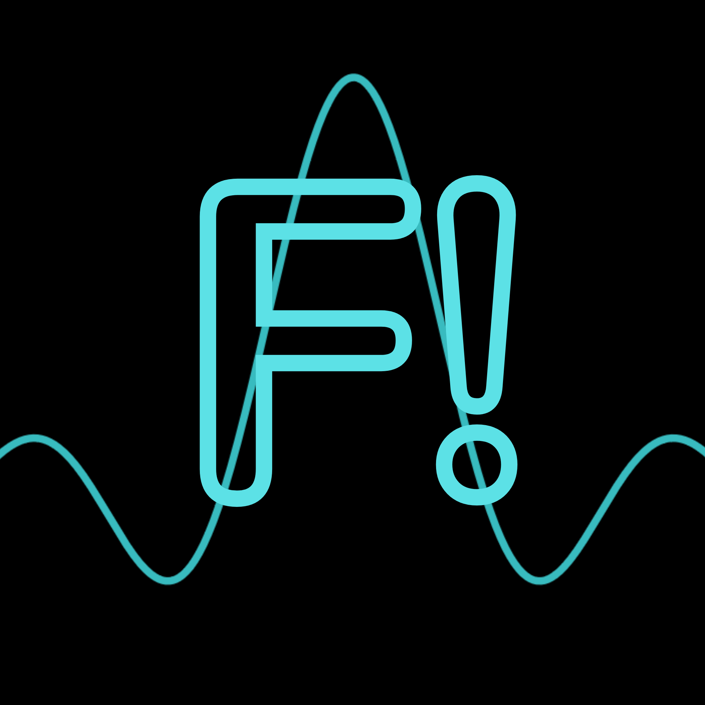
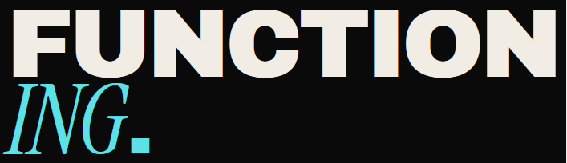
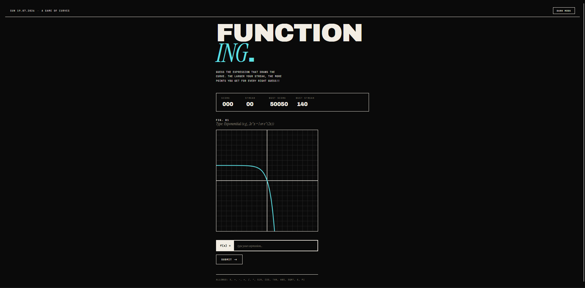

# Functioning!

## Description: What is this and how do I play? It looks complicated!
Functioning! is a game about MATH, everybody's favourite school subject, am I right?!

In Functioning! you have to guess the mathematical expression/formula that when graphed with respect to X on a cartesian plane, produces the curve/line that will be shown to you, play [here](https://functioning.vercel.app)!.

Each round you will be shown a randomly generated graph/curve that falls under a specific category of functions (i.e., linear, quadratic, cubic, etc...), the coefficients are randomized which makes every round unique even if the functions are of the same type.

Your answer doesn't have to be the exact same expression that produced the curve on the graph, it only has to be close in value, you're allow a 0.01 margin of error.

The score is heavily affected by your streak, for every right answer you give, the streak is incremented by 1, the points given per round follow the following formula: given points = 10 + (streak - 1) x 5
This means the larger your streak, the bigger your reward.
Upon submitting a wrong answer, your streak is reset and 50 points are deducted from your score

## How it works: -
### Tech stack:
- HTML
- CSS
- JavaScript
- VSCode
- Hopes and dreams
- Qwen AI for the nightmarous regex

### Behind the scenes:
How the whole game works explained step by step:
1. The website loads
2. The `generateFunction()` method is called
3. The initial score and styling set up runs
4. Canvas is filled and the function is drawn using the `drawGraph()` method
5. Wait for user input
6. Once user submits an answer, it is first parsed using `parseHumanMath()` so it can be evaluated by JavaScript
7. The parsed user function is evaluated at specific test points and the results are compared to the real answer's results at the same points
8. If the results are close enough (max difference is 0.01), the answer is considered correct otherwise it's wrong, after that the score and streak rules from above are applied
9. Pressing the New Curve button allows the player to go to the next round, where we go back to step 1

## Motivation
As you can tell, I'm a pretty big math fan (DOESN'T MEAN I'M GOOD AT IT THOUGH), and I really enjoy guessing how specific functions would look when seeing them as text on a board in class, I would open desmos when I'm bored and start drawing with different functions and stuff and I'd be having so much fun. One day I was like "Hmm.. What if it was the other way around? What if I could see the function but try to get the expression it formed from?", and here we are, HackClub and Horizons was a big push for me to actually work on this idea and I'm really happy with how it turned out!

## AI Usage Declaration
In the development of Functioning!, Qwen AI was only used to fine-tune the regex logic in the `parseHumanMath()` function and some debugging when it came to `checkAnswer()`, as doing those tasks would have taken tremendous effort for a human to do by hand, and without the use of AI I don't think Functioning would be the same as it is now, I would've probably sacrificed a lot of the core functions of the parser and it would've ruined the user experience for non-programmers playing the game.